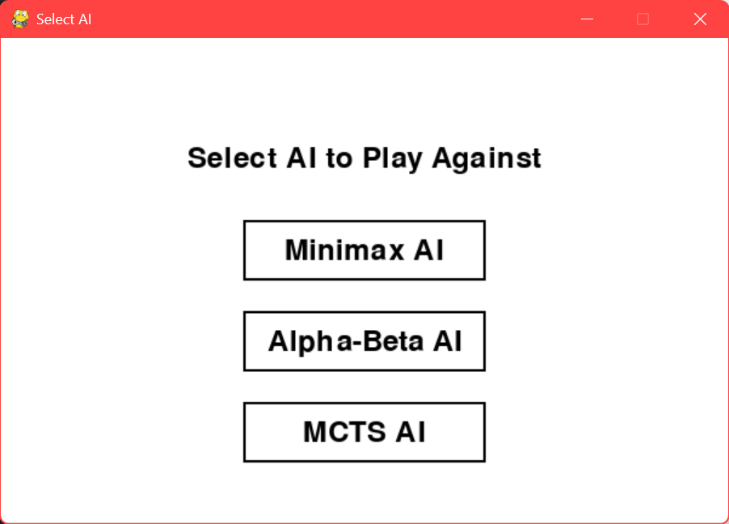
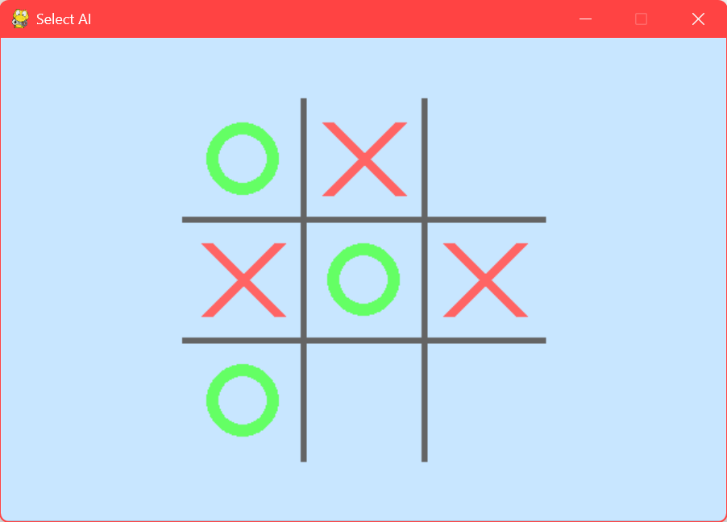

# 🎮 Tic-Tac-Toe AI with Pygame

An interactive **Tic-Tac-Toe** game featuring AI opponents using **Minimax**, **Alpha-Beta Pruning**, and **Monte Carlo Tree Search (MCTS)** algorithms. Built with **Python** and **Pygame**, this project demonstrates AI decision-making in a classic game while tracking time ⏱️ and memory 💾 usage for performance evaluation.




---

## ✨ Features

- Play against three types of AI:
  - 🧠 **Minimax AI** – exhaustive search strategy
  - ⚡ **Alpha-Beta Pruning AI** – optimized Minimax
  - 🎲 **MCTS AI** – probabilistic tree search
- 🎯 Highlight squares on hover for better UX
- ⏱️ Automatically track AI move time and memory usage
- 🖼️ Save game results and screenshots for review

---

## 🛠️ Installation

1. Clone the repository:
```bash
git clone https://github.com/your-username/tic-tac-toe-ai-pygame.git
cd tic-tac-toe-ai-pygame
```
2. Install dependencies:
```bash
pip install -r requirements.txt
```
3. Run the game:
```bash
python main.py
```

- Select your AI opponent from the menu 🕹️.
- Play as X while AI plays as O.
- Game results and screenshots 🖼️ will be saved in the images folder automatically.

---

## 📜 License

This project is licensed under the MIT License.
Feel free to use, modify, and share.
